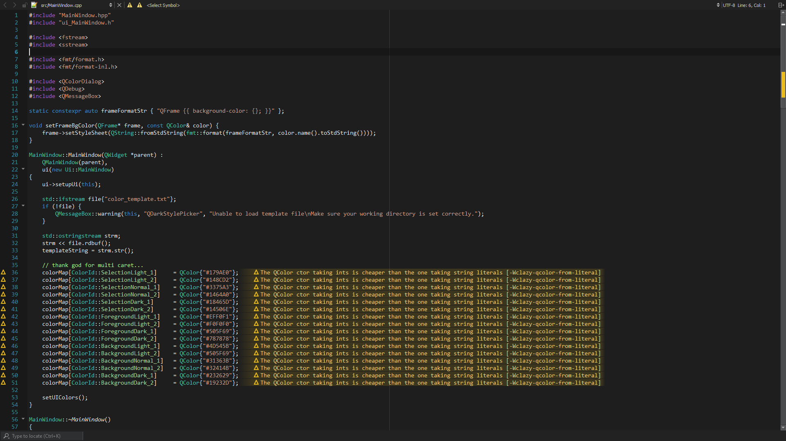
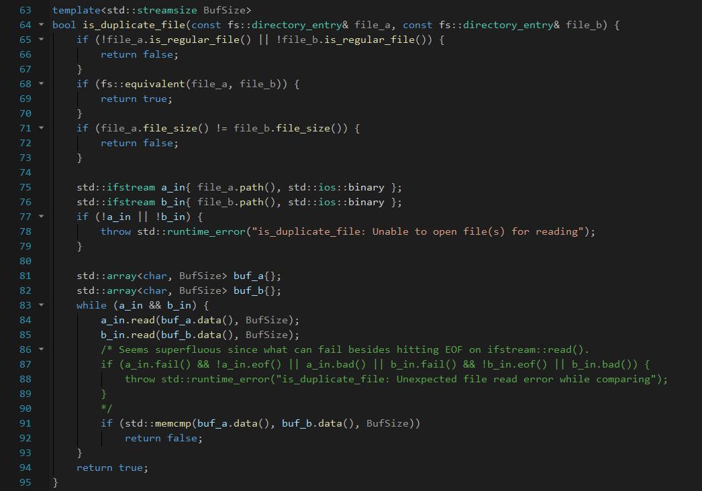
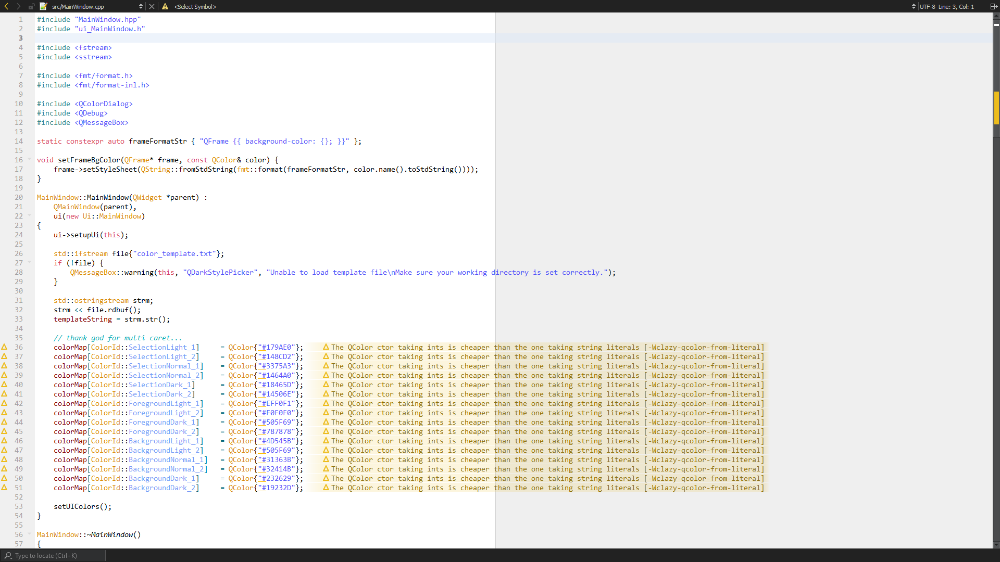
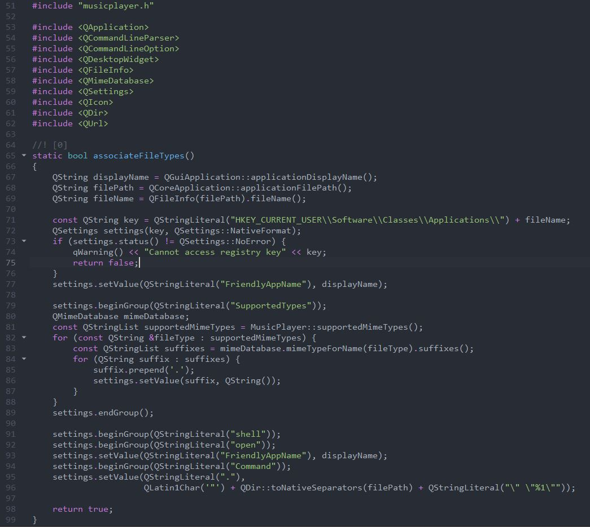
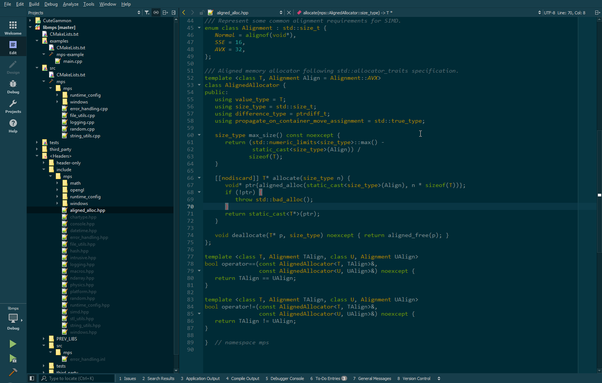

# Windows
* Paste your color *schemes* into `AppData/Roaming/QtProject/qtcreator/styles`
* Paste your color *themes* into `AppData/Roaming/QtProject/qtcreator/themes`

Alternatively, you can run the included `install_windows.bat` which does the same thing.

# Linux
* Paste your color *schemes* into `~/.config/QtProject/qtcreator/styles`
* Paste your color *themes* into `~/.config/QtProject/qtcreator/themes`

## Vistual Studio Dark:

## Visual Studio Dark v2:
The newer version of Visual Studio changed things up a bit. This theme tries to adapt to those changes.
It definitely seems more colorful.

For a slight variation (if you prefer), color #d8a0df rgb(216,160,223) can be used, e.g., for keywords.
Visual Studio only highlights certain control flow keywords with this color, but not all (e.g., struct, class, ...).

## Visual Studio Blue (Light):
.png)

## Visual Studio Blue (Light) v2:
Similarly to the Visual Studio Dark Theme, there are minor adjustments made in newer versions.
Variation color: #8f08c4 rgb(143,  8,196) (see Visual Studio Dark v2)
_v2.png)

## Summer:

## One Dark (Atom)
Works best with One Dark QtCreator Theme and an environment color like #313848

## Solarized Dark
Comes included in QtCreator, but without a matching QtCreator theme (themes/solarized-dark.creatortheme).
Recommended environment color for this theme: #0096c8 (or similar)

